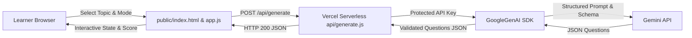

# Requirements

### Overview & Goals
The goal of this project is to build an interactive, high-utility German B1 exam preparation website deployed on Vercel. The application queries Google Gemini using structured JSON schema output to dynamically generate high-quality B1 multiple-choice questions across various grammar and vocabulary topics, guiding learners through sequential questions while tracking their score and delivering pedagogical feedback.

### Scope
- **In Scope**:
  - Curated B1 German curriculum syllabus covering core Grammar and Vocabulary/Situation topics.
  - Secure serverless API proxy (`api/generate.js`) protecting `GEMINI_API_KEY`.
  - Responsive, vanilla HTML/CSS/JavaScript web interface.
  - Dual Study Modes:
    1. *Interactive Practice*: Immediate answer validation, color coding, and explanatory German tips after each question.
    2. *Exam Simulation*: Sequential 5-question test with final score compilation and full review breakdown.
  - Dynamic score tracking and completion summary.
  - Robust loading states, error fallbacks, and retry mechanisms.
  - Vercel deployment setup with zero client build dependencies.
- **Out of Scope**:
  - User authentication and persistent cross-session database storage (keeps deployment lightweight and frictionless).
  - Audio pronunciation synthesis (can be added as a future iteration).

### User Stories
- As a German B1 learner, I want to select specific grammar topics (e.g., Konjunktiv II, Passiv) or thematic vocabulary so that I can focus my study on my weak areas.
- As a learner in practice mode, I want instant feedback and clear German tips when I pick an answer so that I immediately understand my mistakes.
- As a learner in exam mode, I want to answer a full 5-question set consecutively and receive a graded score report at the end to simulate exam conditions.
- As a learner, I want responsive and clear UI feedback during question generation so that I know the system is actively working.

### Functional Requirements
- **Subject Selection**: Dropdown menu organized with `<optgroup>` for *Grammatik* and *Wortschatz & Alltag*.
- **Mode Toggle**: Radio/toggle switch between *Interactive Practice* and *Exam Simulation*.
- **Question Presentation**: Displays one question at a time with 5 plausible options.
- **Answer Validation**:
  - In Practice mode: Highlights correct option in green and incorrect selected option in red, displaying the `tip` text.
  - In Exam mode: Records user answer and advances or allows navigation to the next question.
- **Scoring System**: Calculates correct answers / total questions (e.g., 4/5 - 80%).
- **Error Handling**: Displays an actionable error message with a retry button if the Gemini API request fails.

# Technical Design

### Current Implementation
The workspace currently contains:
- `generate.js`: A standalone Node.js script using `@google/genai` to generate 5 Konjunktiv II questions with strict JSON schema and save them to `questions.json`.
- `list-models.js`: A script listing available Gemini models.
- `package.json`: Configured with `"type": "module"` and `@google/genai` dependency.

### Key Decisions
1. **Architecture & Stack**: Vanilla HTML5, CSS3, and ES6 JavaScript hosted statically, combined with a Vercel Serverless Function (`api/generate.js`).
   - *Rationale*: Minimizes bundle overhead, eliminates complex client build pipelines, and ensures `GEMINI_API_KEY` remains securely on the server side.
2. **Dynamic Generation vs Static Storage**: On-demand generation via Gemini API for fresh question sets on each attempt.
   - *Rationale*: Maximizes variety and learning utility while adhering to the exact schema defined in `generate.js`.
3. **Dual Study Modes**: Support for both instant pedagogical feedback and timed/sequential exam simulation.
   - *Rationale*: Caters to different stages of revision (concept reinforcement vs exam readiness).

### Architecture Diagram


### Data Models / Contracts

#### API Request (`POST /api/generate`)
```json
{
  "subject": "grammar",
  "topic": "Konjunktiv II"
}
```

#### API Response (`questions.json` contract)
```json
{
  "questions": [
    {
      "id": "q1",
      "subject": "grammar",
      "topic": "Konjunktiv II",
      "level": "B1",
      "question": "Wenn ich Zeit hätte, ________ ich dich besuchen.",
      "options": ["werde", "würde", "hätte", "wäre", "konnte"],
      "correct": 1,
      "tip": "Im Konjunktiv II wird 'würde' + Infinitiv verwendet."
    }
  ]
}
```

### File Structure
```
german-b1/
├── api/
│   └── generate.js         # Vercel serverless function (Gemini backend proxy)
├── public/
│   ├── index.html          # Main application page with topic dropdown and quiz card
│   ├── style.css           # Modern, responsive styles and color-coded feedback
│   └── app.js              # State machine, API client, score keeper, and UI renderer
├── generate.js             # Existing CLI generation script
├── list-models.js          # Existing model listing script
├── package.json            # Node.js dependencies
└── vercel.json             # Vercel routing and serverless function configuration
```

### Risks & Mitigations
- **API Key Leakage**: Calling Gemini directly from browser JavaScript exposes the private key. *Mitigation*: All Gemini calls are isolated in `/api/generate.js`.
- **Gemini Rate Limits / Latency**: Generating structured JSON may take 1–2 seconds or encounter rate limits. *Mitigation*: Clear loading spinner states, timeout handling, and user-friendly retry buttons.
- **Schema Validation Errors**: Model returning malformed JSON. *Mitigation*: Strict schema enforcement with `responseSchema` and fallback parsing verification in the serverless handler.

# Testing

### Validation Approach
Verification will be performed across backend API contract compliance, frontend state transitions, dual-mode behavior, and Vercel routing configuration.

### Key Scenarios
1. **Subject Selection & Generation**:
   - Select a topic (e.g., *Passiv* or *Adjektivdeklination*).
   - Trigger generation and verify request to `/api/generate`.
   - Verify loading spinner is displayed until response is received.
2. **Interactive Practice Mode**:
   - Answer Question 1 correctly: button turns green, tip is displayed, score increments.
   - Answer Question 2 incorrectly: selected button turns red, correct button turns green, tip is displayed, score remains unchanged.
   - Click "Next Question" to advance through all 5 questions.
3. **Exam Simulation Mode**:
   - Switch to Exam mode.
   - Select answers for all 5 questions consecutively without revealing answers or tips.
   - Submit exam and verify the final report screen displays total score, percentage, and detailed question-by-question breakdown.
4. **Retry and Topic Switch**:
   - Click "Restart Quiz" or select a new topic to ensure quiz state resets cleanly.

### Edge Cases
- **Missing or Invalid `GEMINI_API_KEY`**: Serverless function returns clean JSON error (`500`) and UI shows a helpful configuration warning.
- **Network / API Failure**: UI displays an error alert with a "Retry" button rather than breaking the page.
- **Rapid Clicking**: Option buttons are disabled after initial selection in Practice mode to prevent double-scoring.

# Delivery Steps

### ✓ Step 1: Implement Gemini Serverless API Handler
The serverless endpoint `/api/generate.js` receives subject and topic parameters via POST and returns 5 validated B1 questions from Gemini without exposing API keys.

- Create `api/generate.js` using `@google/genai` to handle `POST` requests and parse request payloads (`subject`, `topic`).
- Port the strict JSON schema and prompt template from `generate.js` into the serverless handler.
- Read `GEMINI_API_KEY` strictly from `process.env.GEMINI_API_KEY` on the server runtime.
- Implement input validation and error handling returning appropriate HTTP status codes (400 for invalid inputs, 500 for Gemini API failures).

### ✓ Step 2: Build HTML Structure and Responsive UI Styling
The web application UI layout and responsive design are ready, featuring the subject selector, mode toggle, and quiz container.

- Create `public/index.html` with semantic structure for header, topic selection dropdown (grouped by Grammatik and Wortschatz), mode toggle (Interactive vs Exam), quiz card, and score summary view.
- Create `public/style.css` with clean, accessible styling for option buttons (idle, selected, correct, incorrect), progress bar, tip reveal cards, and responsive layout for mobile and desktop.
- Embed curated B1 subjects (Konjunktiv II, Passiv, Relativsätze, Nebensätze, Verben mit Präpositionen, Adjektivdeklination, etc.) directly into the selector.

### ✓ Step 3: Implement Client-Side Quiz Engine and Dual-Mode State Machine
The frontend state machine handles question progression, option selection, instant tip reveal in Practice Mode, and deferred evaluation in Exam Mode.

- Create `public/app.js` implementing the quiz state machine (`idle`, `loading`, `in_progress`, `question_answered`, `finished`).
- Implement Dual Mode logic:
  - **Interactive Practice**: Immediate visual feedback (green/red) and tip display after clicking an option, with a "Next Question" button.
  - **Exam Simulation**: Allows selecting an answer and navigating through all 5 questions before submitting for a final graded report.
- Maintain running score tally and question index (`currentQuestionIndex / totalQuestions`).
- Render final score summary card with percentage, performance feedback, and a button to retest or select a new subject.

### ✓ Step 4: Integrate Error Handling, Loading States, and Vercel Configuration
The application gracefully handles API errors and network timeouts, and includes complete Vercel deployment configuration.

- Add loading skeleton/spinner state in `public/app.js` during Gemini API generation.
- Implement user-friendly error banners and retry buttons when API generation fails or quota is exceeded.
- Add `vercel.json` configuring static file routing for `public/` and serverless route routing for `/api/*`.
- Verify environment variable requirements and document local execution steps in `README.md`.